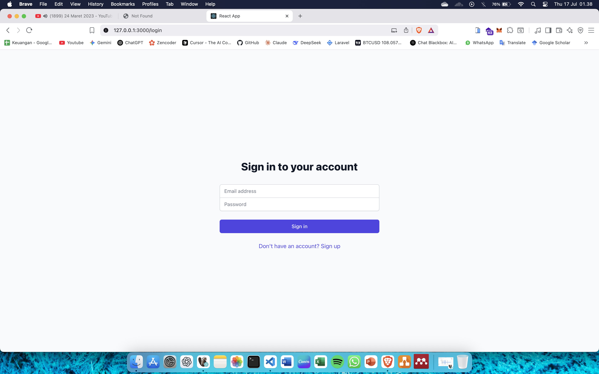
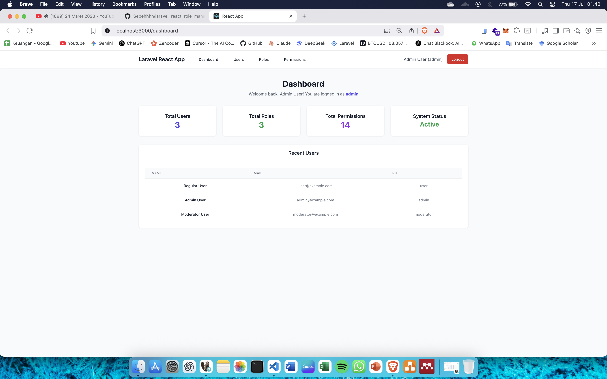
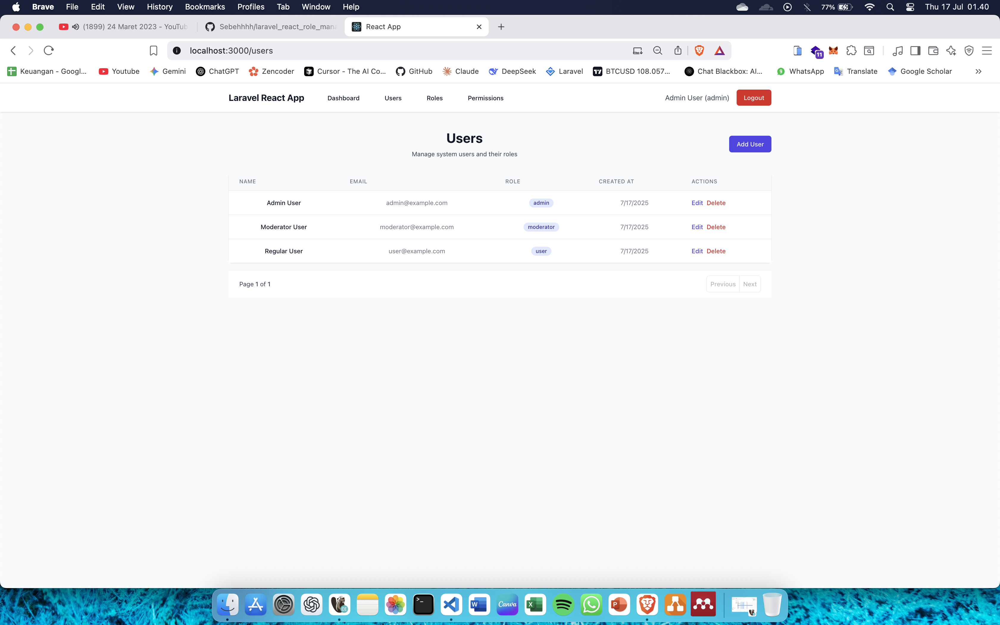
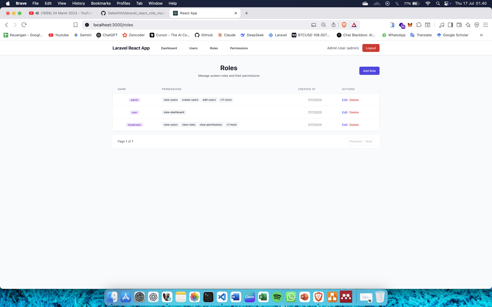

# 🛡️ Laravel React Role Management System

A comprehensive role-based access control (RBAC) system built with Laravel 12 and React TypeScript. This system provides a complete solution for managing users, roles, and permissions with an intuitive admin dashboard.

## 📋 Current Version Info

| Component | Version | Status |
|-----------|---------|--------|
| Laravel Framework | 12.20.0 | ✅ Latest |
| PHP | 8.4.1 | ✅ Latest |
| React | 19.1.0 | ✅ Latest |
| TypeScript | 4.9.5 | ✅ Stable |
| Node.js | 18.20.6 | ✅ LTS |
| TailwindCSS | 3.4.17 | ✅ Latest |
| Laravel Sanctum | 4.0+ | ✅ Latest |
| Spatie Permission | 6.20+ | ✅ Latest |

## 🚀 Features

### 🔐 Authentication & Authorization
- **JWT Authentication** with Laravel Sanctum
- **Role-based Access Control** (RBAC)
- **Permission-based Security**
- **Secure Session Management**
- **Automatic Role Persistence** (fixed refresh issues)

### 👥 User Management
- Complete CRUD operations for users
- Role assignment for users
- User profile management
- Password security with hashing

### 🎭 Role & Permission System
- **Dynamic Role Management** - Create, edit, delete roles
- **Flexible Permission System** - Granular permission control
- **Role-Permission Mapping** - Assign permissions to roles
- **Permission Inheritance** - Users inherit permissions from roles

### 📊 Admin Dashboard
- **Real-time Statistics** - User, role, and permission counts
- **Recent Users Display** - Latest registered users
- **Role-based Dashboard Views** - Different views for admin, moderator, and user
- **Permission-based Navigation** - Dynamic menu based on user permissions

### 🎨 Modern UI/UX
- **Responsive Design** with TailwindCSS
- **Clean Interface** - Intuitive admin panel
- **TypeScript Support** - Type-safe frontend development
- **Component-based Architecture** - Reusable React components

## 📸 Screenshots

### 🔑 Login Page


### 📊 Admin Dashboard


### 👥 User Management


### 🎭 Role Management


### 🔐 Permission Management


## 🛠️ Technology Stack

### Backend
- **Laravel 12.20.0** - PHP framework
- **Laravel Sanctum 4.0+** - API authentication
- **Spatie Permission 6.20+** - Role & permission management
- **SQLite** - Database (default)
- **PHP 8.2+** - Server-side language (tested with PHP 8.4.1)

### Frontend
- **React 19.1.0** - JavaScript library
- **TypeScript 4.9.5** - Type safety
- **TailwindCSS 3.4.17** - Styling framework
- **React Router 6.30.1** - Client-side routing
- **Axios 1.10.0** - HTTP client
- **Node.js 18.20.6** - Runtime environment
- **React Scripts 5.0.1** - Build tools
- **Testing Library** - Testing utilities

### Development Tools
- **Laravel Breeze 2.3+** - Authentication scaffolding
- **Laravel Pint 1.13+** - Code style fixer
- **PHPUnit 11.5.3+** - PHP testing framework
- **Concurrently 8.2.0+** - Run multiple commands
- **PostCSS 8.5.6+** - CSS processing
- **Autoprefixer 10.4.21+** - CSS vendor prefixes

## 📁 Project Structure

```
laravel_app/
├── app/                    # Laravel application code
│   ├── Http/Controllers/   # API controllers
│   ├── Models/            # Eloquent models
│   └── Providers/         # Service providers
├── database/              # Database migrations and seeders
├── frontend/              # React TypeScript application
│   ├── src/
│   │   ├── components/    # React components
│   │   ├── contexts/      # React contexts
│   │   └── services/      # API services
│   ├── public/           # Static assets
│   └── package.json      # Frontend dependencies
├── routes/               # API routes
├── composer.json         # Backend dependencies
├── package.json          # Root package.json for scripts
└── README.md            # This file
```

## 🚀 Installation

### Prerequisites
- **PHP 8.2 or higher** (tested with PHP 8.4.1)
- **Node.js 18 or higher** (tested with Node.js 18.20.6)
- **Composer 2.x**
- **SQLite** (default) or **MySQL** (optional)

### Backend Setup

1. **Clone the repository**
```bash
git clone https://github.com/Sebehhhh/laravel_react_role_management.git
cd laravel_react_role_management
```

2. **Install PHP dependencies**
```bash
composer install
```

3. **Environment setup**
```bash
cp .env.example .env
php artisan key:generate
```

4. **Database configuration**
```bash
# Default configuration uses SQLite (no additional setup required)
DB_CONNECTION=sqlite

# Or for MySQL, edit .env file with your database credentials:
# DB_CONNECTION=mysql
# DB_HOST=127.0.0.1
# DB_PORT=3306
# DB_DATABASE=laravel_role_management
# DB_USERNAME=your_username
# DB_PASSWORD=your_password
```

5. **Run migrations and seeders**
```bash
php artisan migrate
php artisan db:seed
```

6. **Start the Laravel server**
```bash
php artisan serve
```

### Frontend Setup

1. **Navigate to frontend directory**
```bash
cd frontend
```

2. **Install dependencies**
```bash
npm install
```

3. **Start development server**
```bash
npm start
```

### 🚀 Quick Start (Both Backend & Frontend)

For development, you can run both backend and frontend simultaneously:

```bash
# Install all dependencies
npm run setup

# Run both backend and frontend
npm run dev

# Or run them separately
npm run dev:backend  # Laravel server at http://localhost:8000
npm run dev:frontend # React app at http://localhost:3000
```

### 🔄 Fresh Installation
```bash
# Reset database and reseed
npm run fresh
```

### 🧪 Testing
```bash
# Run backend tests
npm run test
# or
php artisan test

# Run frontend tests
cd frontend && npm test
```

## 🔧 Configuration

### Application URLs
- **Backend API**: http://localhost:8000
- **Frontend App**: http://localhost:3000
- **Database**: SQLite (file-based, no server needed)

### Default Users
After running the seeders, you can login with:

| Role | Email | Password |
|------|-------|----------|
| Admin | admin@example.com | password123 |
| Moderator | moderator@example.com | password123 |
| User | user@example.com | password123 |

### Permissions
The system includes the following default permissions:
- `view-users`, `create-users`, `edit-users`, `delete-users`
- `view-roles`, `create-roles`, `edit-roles`, `delete-roles`
- `view-permissions`, `create-permissions`, `edit-permissions`, `delete-permissions`
- `view-dashboard`, `manage-settings`

## 🎯 Usage

### Admin Features
- **Full System Access** - All CRUD operations
- **User Management** - Create, edit, delete users
- **Role Management** - Manage all roles and permissions
- **System Statistics** - View complete dashboard

### Moderator Features
- **Limited Access** - View users and basic operations
- **Read-only Permissions** - View roles and permissions
- **Basic Dashboard** - User statistics only

### User Features
- **Profile Access** - View and edit own profile
- **Basic Dashboard** - Welcome message and profile info

## 🔐 Security Features

- **JWT Token Authentication**
- **Role-based Route Protection**
- **Permission-based UI Components**
- **CSRF Protection**
- **XSS Protection**
- **SQL Injection Prevention**

## 🐛 Bug Fixes

### Recent Fixes
- ✅ **Fixed role persistence after page refresh**
- ✅ **Fixed dashboard recent users showing incorrect roles**
- ✅ **Added proper relationship loading for user data**
- ✅ **Enhanced debugging capabilities**

## 🤝 Contributing

1. Fork the repository
2. Create a feature branch (`git checkout -b feature/amazing-feature`)
3. Commit your changes (`git commit -m 'Add some amazing feature'`)
4. Push to the branch (`git push origin feature/amazing-feature`)
5. Open a Pull Request

## 📄 License

This project is licensed under the MIT License - see the LICENSE file for details.

## 👨‍💻 Author

**Sebehhhh**
- GitHub: [@Sebehhhh](https://github.com/Sebehhhh)
- Project: [Laravel React Role Management](https://github.com/Sebehhhh/laravel_react_role_management)

## 🙏 Acknowledgments

- Laravel Team for the amazing framework
- React Team for the powerful library
- Spatie for the excellent permission package
- TailwindCSS for the beautiful styling framework

---

⭐ **If you found this project helpful, please give it a star!** ⭐