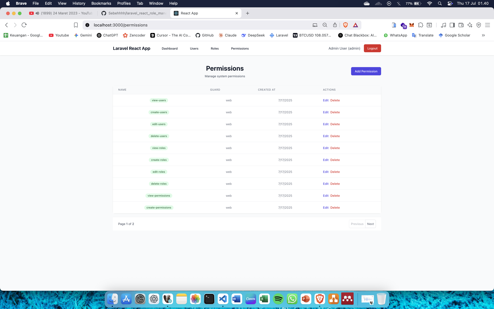

# 🛡️ Laravel React Role Management System

A comprehensive role-based access control (RBAC) system built with Laravel 11 and React TypeScript. This system provides a complete solution for managing users, roles, and permissions with an intuitive admin dashboard.

## 🚀 Features

### 🔐 Authentication & Authorization
- **JWT Authentication** with Laravel Sanctum
- **Role-based Access Control** (RBAC)
- **Permission-based Security**
- **Secure Session Management**
- **Automatic Role Persistence** (fixed refresh issues)

### 👥 User Management
- Complete CRUD operations for users
- Role assignment for users
- User profile management
- Password security with hashing

### 🎭 Role & Permission System
- **Dynamic Role Management** - Create, edit, delete roles
- **Flexible Permission System** - Granular permission control
- **Role-Permission Mapping** - Assign permissions to roles
- **Permission Inheritance** - Users inherit permissions from roles

### 📊 Admin Dashboard
- **Real-time Statistics** - User, role, and permission counts
- **Recent Users Display** - Latest registered users
- **Role-based Dashboard Views** - Different views for admin, moderator, and user
- **Permission-based Navigation** - Dynamic menu based on user permissions

### 🎨 Modern UI/UX
- **Responsive Design** with TailwindCSS
- **Clean Interface** - Intuitive admin panel
- **TypeScript Support** - Type-safe frontend development
- **Component-based Architecture** - Reusable React components

## 📸 Screenshots

### 🔑 Login Page


### 📊 Admin Dashboard


### 👥 User Management


### 🎭 Role Management


### 🔐 Permission Management


## 🛠️ Technology Stack

### Backend
- **Laravel 11** - PHP framework
- **Laravel Sanctum** - API authentication
- **Spatie Permission** - Role & permission management
- **MySQL** - Database
- **PHP 8.1+** - Server-side language

### Frontend
- **React 18** - JavaScript library
- **TypeScript** - Type safety
- **TailwindCSS** - Styling framework
- **React Router** - Client-side routing
- **Axios** - HTTP client

## 🚀 Installation

### Prerequisites
- PHP 8.1 or higher
- Node.js 16 or higher
- Composer
- MySQL

### Backend Setup

1. **Clone the repository**
```bash
git clone https://github.com/Sebehhhh/laravel_react_role_management.git
cd laravel_react_role_management
```

2. **Install PHP dependencies**
```bash
composer install
```

3. **Environment setup**
```bash
cp .env.example .env
php artisan key:generate
```

4. **Database configuration**
```bash
# Edit .env file with your database credentials
DB_CONNECTION=mysql
DB_HOST=127.0.0.1
DB_PORT=3306
DB_DATABASE=laravel_role_management
DB_USERNAME=your_username
DB_PASSWORD=your_password
```

5. **Run migrations and seeders**
```bash
php artisan migrate
php artisan db:seed
```

6. **Start the Laravel server**
```bash
php artisan serve
```

### Frontend Setup

1. **Navigate to frontend directory**
```bash
cd frontend
```

2. **Install dependencies**
```bash
npm install
```

3. **Start development server**
```bash
npm start
```

## 🔧 Configuration

### Default Users
After running the seeders, you can login with:

| Role | Email | Password |
|------|-------|----------|
| Admin | admin@example.com | password123 |
| Moderator | moderator@example.com | password123 |
| User | user@example.com | password123 |

### Permissions
The system includes the following default permissions:
- `view-users`, `create-users`, `edit-users`, `delete-users`
- `view-roles`, `create-roles`, `edit-roles`, `delete-roles`
- `view-permissions`, `create-permissions`, `edit-permissions`, `delete-permissions`
- `view-dashboard`, `manage-settings`

## 🎯 Usage

### Admin Features
- **Full System Access** - All CRUD operations
- **User Management** - Create, edit, delete users
- **Role Management** - Manage all roles and permissions
- **System Statistics** - View complete dashboard

### Moderator Features
- **Limited Access** - View users and basic operations
- **Read-only Permissions** - View roles and permissions
- **Basic Dashboard** - User statistics only

### User Features
- **Profile Access** - View and edit own profile
- **Basic Dashboard** - Welcome message and profile info

## 🔐 Security Features

- **JWT Token Authentication**
- **Role-based Route Protection**
- **Permission-based UI Components**
- **CSRF Protection**
- **XSS Protection**
- **SQL Injection Prevention**

## 🐛 Bug Fixes

### Recent Fixes
- ✅ **Fixed role persistence after page refresh**
- ✅ **Fixed dashboard recent users showing incorrect roles**
- ✅ **Added proper relationship loading for user data**
- ✅ **Enhanced debugging capabilities**

## 🤝 Contributing

1. Fork the repository
2. Create a feature branch (`git checkout -b feature/amazing-feature`)
3. Commit your changes (`git commit -m 'Add some amazing feature'`)
4. Push to the branch (`git push origin feature/amazing-feature`)
5. Open a Pull Request

## 📄 License

This project is licensed under the MIT License - see the LICENSE file for details.

## 👨‍💻 Author

**Sebehhhh**
- GitHub: [@Sebehhhh](https://github.com/Sebehhhh)
- Project: [Laravel React Role Management](https://github.com/Sebehhhh/laravel_react_role_management)

## 🙏 Acknowledgments

- Laravel Team for the amazing framework
- React Team for the powerful library
- Spatie for the excellent permission package
- TailwindCSS for the beautiful styling framework

---

⭐ **If you found this project helpful, please give it a star!** ⭐